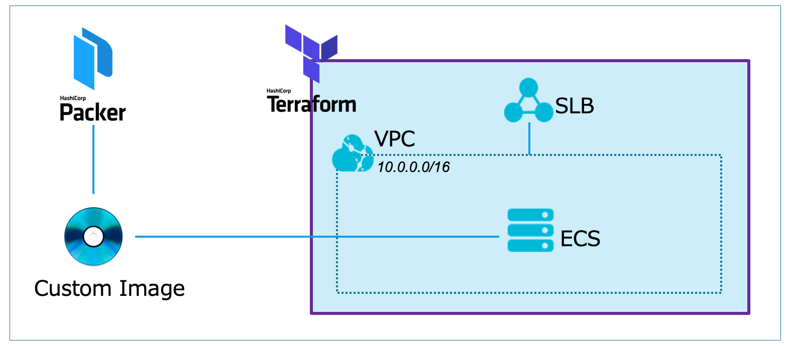

# Alibaba Cloud デモ環境構築

このリポジトリは、Alibaba Cloud へPackerとTerraformを使用して、簡単なデモサイトを構築する為のリポジトリです。  
検証を目的としていますので、本番環境での利用はご遠慮ください。

## 目次
* [バージョン](#バージョン)
* [事前準備](#事前準備)
* [環境構成イメージ](#環境構成イメージ)
* [環境変数設定](#環境変数設定)
* [カスタムイメージ作成](#カスタムイメージ作成)
* [環境構築](#環境構築)
* [サイト表示](#サイト表示)
* [環境消去](#環境消去)

## バージョン

デモ環境作成時に利用していたバージョンは以下となります。  
[Terraform v0.11.10]  
[Packer v1.4.0]

## 事前準備

* アクセスキーとシークレットキーを準備してください
* SLBとECSを利用可能な状態にしてください

### 実行環境

パケージを実行環境へ直接インストールするか、Dockerイメージを利用するかのどちらかで実行環境をセットアップしてください。  
セットアップ後に、このリポジトリを実行環境へクローンしてください。

* パッケージをインストールする場合
  * PackerとTerraformを、実行環境へインストールしてください
    * [Packer](https://www.packer.io/intro/getting-started/install.html)
    * [Terraform](https://learn.hashicorp.com/terraform/getting-started/install.html)
* Dockerイメージを利用する場合
   * TerraformとPakcerをインストールしたDockerイメージをDocker Hubへ作成しましたので、そちらのイメージをご利用ください(イメージをpullする際に、docker loginが必要な場合があります)
```
docker run -it --name demo arimas/alicloud_deploy_demo /bin/bash
```
* このリポジトリを実行環境へクローンしてください
```
git clone https://github.com/s-ari/alicloud_deploy_demo.git
```

## 環境構成イメージ



## 環境変数設定

* 認証情報については、環境変数から読み込み実行する為、アクセスキーとシークレットキーを変数へセットしてください
```
export ALICLOUD_ACCESS_KEY="<アクセスキー>"
export ALICLOUD_SECRET_KEY="<シークレットキー>"
export TF_VAR_access_key="${ALICLOUD_ACCESS_KEY}"
export TF_VAR_secret_key="${ALICLOUD_SECRET_KEY}"
```

## カスタムイメージ作成

* Packerを使用し、Apacheがインストールされたイメージを作成します
* 作成されたイメージのIDを環境変数へセットします
```
packer build alicloud_deploy_demo/packer/demo/demo.json
export TF_VAR_image_id="<イメージのID>"
```

## 環境構築

* Terraformを使用してデモ環境へ、VPC/ECS/SecutiryGroup/SLBを作成します
* 起動したECSはSLBへ追加されます
```
cd alicloud_deploy_demo/terraform/demo
terraform init
terraform apply
```

## サイト表示

* デモ用のWebサイトを表示します
* SLBのグローバルIPを確認し、ブラウザから接続してください
* デモページに「Alibaba Cloud Demo Site」と表示されれば成功です
```
http://<SLB_GLOBAL_IP_ADDRESS>/demo.html
```

## 環境消去

* Terraformで構築されたデモ環境を消去します
```
terraform destroy
```
